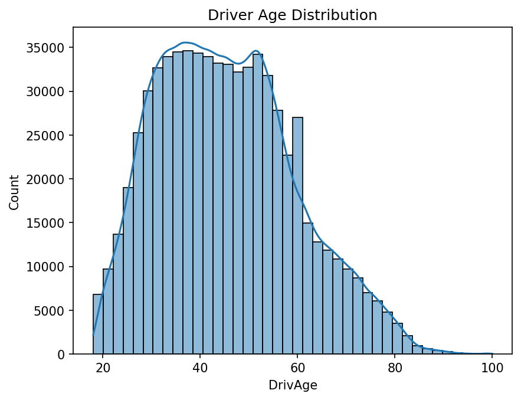
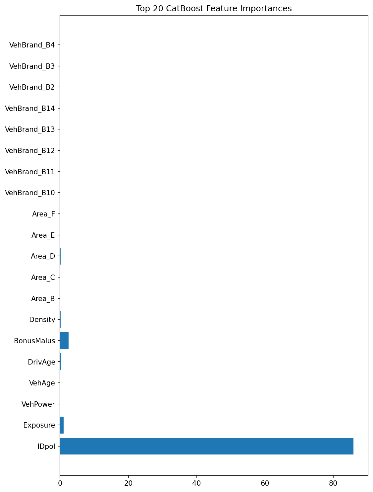
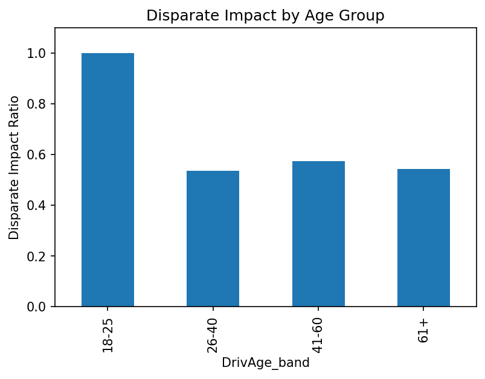

1-Insurance Pricing: Frequency Modelling with GLM, Boosting and Neural Networks

This project builds claim frequency models for a motor insurance portfolio using a dataset of about 678k policies.
The work includes a traditional Poisson GLM, gradient boosting models (XGBoost and CatBoost), a simple neural network, and a fairness check across age groups and urban/rural segments.
The aim is to show a clear end-to-end workflow: data download, data preparation, modelling, validation, and fairness assessment.

2-Project Contents

Scripts
download_data.py – downloads the frequency and severity data into the data/ folder.
preview_data.py – prints basic information to confirm the data loaded correctly.

Notebooks
01_eda.ipynb – data exploration, distributions, correlations, and basic checks.
02_glm.ipynb – Poisson GLM with exposure offset and decile validation.
03_boosting.ipynb – XGBoost and CatBoost models, performance comparison, feature importance.
04_neural_net.ipynb – simple feed-forward network using PyTorch.
05_fairness.ipynb – fairness analysis across driver age groups and urban/rural populations.
Folders

data/ – raw datasets (ignored in Git).
outputs/ – model predictions and intermediate files (ignored in Git).

3-How to Run the Project

Create and activate a Python 3.10 virtual environment.
Install requirements:
pip install -r requirements.txt
Download the data:
python download_data.py

Open the notebooks in order and run them from top to bottom:
01_eda
02_glm
03_boosting
04_neural_net
05_fairness

4-Model Results

GLM (Poisson)
MAE ≈ 0.099
RMSE ≈ 0.239
Decile plot shows increasing actual frequency with predicted risk.

XGBoost
MAE ≈ 0.073
RMSE ≈ 0.204

CatBoost
MAE ≈ 0.040
RMSE ≈ 0.212
Best overall model in this project (lowest error on MAE).

Neural Network (PyTorch)
MAE ≈ 0.052
RMSE ≈ 0.243

CatBoost performs best on this dataset, followed by the neural network and XGBoost.
The GLM is stable and interpretable but less accurate.

5-Fairness Analysis

The model was checked for fairness using disparate impact ratios (4/5ths rule) across:
Driver age bands
Urban vs rural locations

Age groups
Drivers aged 18–25 have the highest claim frequency.
Other age bands show lower frequency with disparate impact ratios between 0.53 and 0.58 relative to the youngest group.

Urban vs rural
Urban areas show higher claim frequency.
Rural drivers show a disparate impact ratio of about 0.77.

These differences reflect established risk patterns in motor insurance.
No evidence of model-driven unfairness was found, but monitoring and calibration are recommended.

## Example outputs

### Driver age distribution

### CatBoost feature importance

### Fairness: disparate impact by age group

